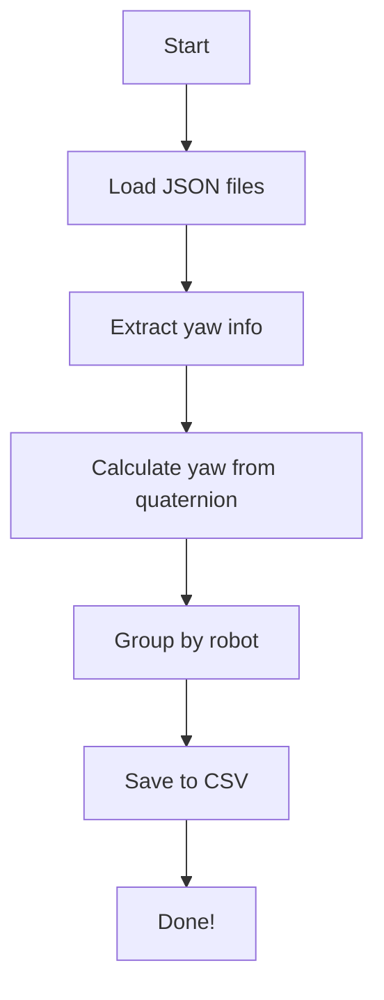

# `amr_check_yaw.py`

This script processes Unity simulation output (stored as JSON step files) to:
- Extract the yaw (rotation around the Z-axis) of AMRs.
- Compare the **given yaw** from JSON with the **calculated yaw** from quaternions.
- Save the extracted yaw data into a **CSV file** for further analysis.

---

## Project Structure

```plaintext
project/
├── your_script.py
├── quaternion2euler.py
├── dataset/
│   ├── sequence.0_json_only/   # Folder with JSON step files
│   └── class_definition_semantic_segmentation.json
├── Export/                     # Output CSV files
```

---

## Requirements

- Python 3.8+
- Packages:
  - `numpy`
  - `pandas`
  - `plotly`
  - `natsort`
  - `tqdm`

## 🚀 How to Run

1. **Set the dataset path** in the script (`path_to_dataset`).
2. Make sure your JSON files are available in the `sequence.0_json_only` folder.
3. Execute:

```bash
python your_script.py
```

4. The output CSV file will be saved to:

```
<dataset_root>/Export/AMR_Check_Yaw.csv
```

---

## 📚 Main Components

### `main()`
- Defines data paths.
- Loads JSON files and processes them.

### `load_json_files(path_to_jsons, frame_step)`
- Loads and optionally samples JSON files based on the frame step.
- Handles decoding errors gracefully.

### `unity_quaternion_to_ros_yaw(q_unity)`
- Converts a Unity quaternion `(x, y, z, w)` to a **ROS-style** yaw (Euler Z angle).
- Uses `quaternion2euler()` function.

### `read_positions(data, savepath)`
- Extracts robot ID, timestamps, and yaw (both given and recalculated) from each JSON frame.
- Groups data by robot.
- Saves the processed yaw data into a CSV file.

---

## 📤 Output CSV Structure

The output file `AMR_Check_Yaw.csv` contains:

| Robot_ID | Timestamp | Yaw_Given | Yaw_Calculated |
|:--------:|:---------:|:---------:|:--------------:|
| AMR_1    | 12345678  | 45.0      | 44.7           |
| AMR_2    | 12345678  | 90.0      | 89.5           |

---

## ⚠️ Notes

- Only JSON objects of type `type.custom/solo.2DLidar` with `'front'` in their ID are processed.
- Unity quaternions have a different axis convention than ROS quaternions. This is handled in `unity_quaternion_to_ros_yaw`.
- The script skips frames with unreadable or corrupt JSON files.

---

## 🛠️ Customization

- To change how many frames you sample (e.g., every frame, every second frame), modify:

```python
frame_step = 1  # Process every frame
```

- To change the save filename, edit inside `save_robot_positions_to_csv()`.

---

## 📈 Example Usage Flow



---

# ✅ That's it!
This script helps **verify orientation tracking** in mobile robot simulations by comparing Unity's stored yaw data and recalculated yaw from quaternions.
